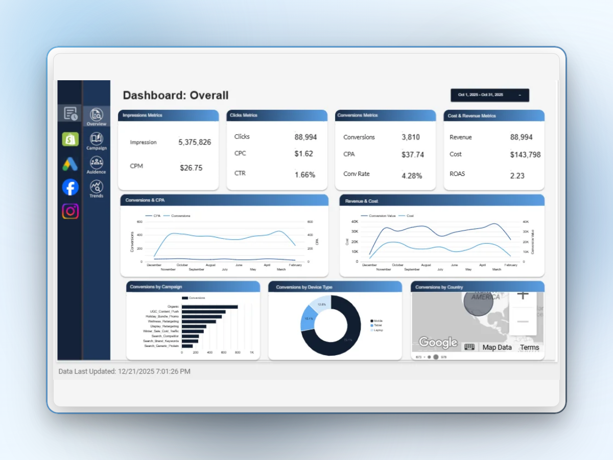
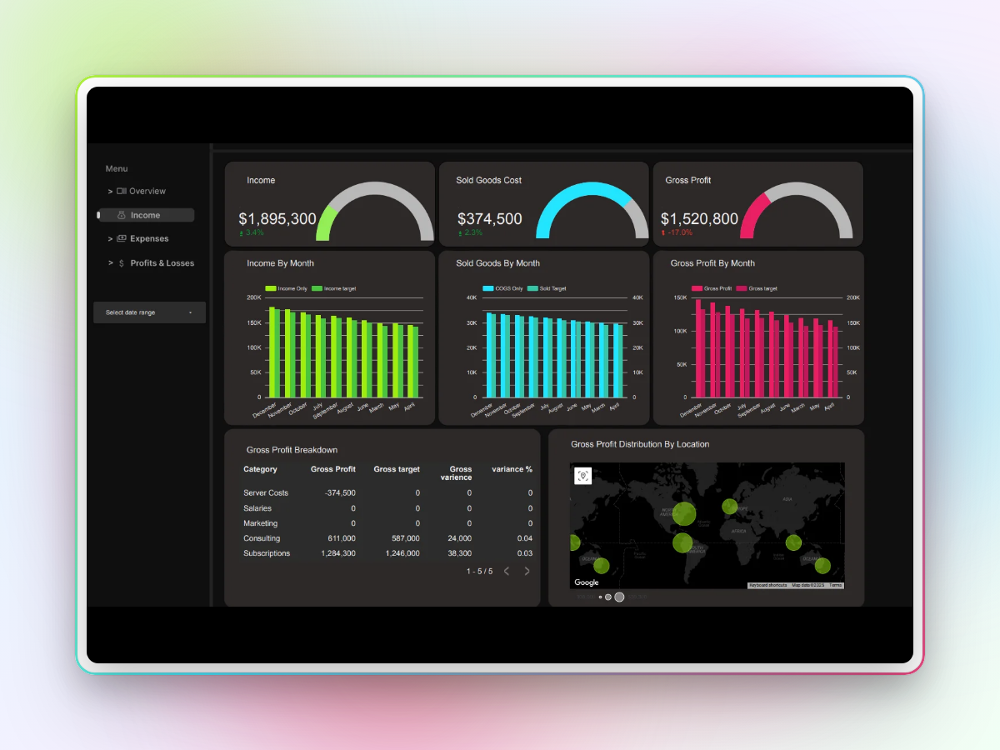

# PERFORMANCE OPTIMIZATION IMPLEMENTATION GUIDE

## STEP 1: Image Optimization (REQUIRED - Do this first!)

### Option A: Using the Python Script (Recommended)
```bash
# Install Pillow if you don't have it
pip install Pillow

# Run the optimization script
python optimize_images.py
```

This will:
- Create `images/optimized/` with WebP versions
- Create `images/originals/` with backups
- Generate responsive variants for all breakpoints
- Save ~70-80% on image sizes

### Option B: Online Tools (Alternative)
If you can't run Python, use these online tools:

1. **Squoosh.app** (Google's tool):
   - Visit https://squoosh.app
   - Upload each PNG from `images/`
   - Set format to WebP, quality 85
   - Download and save to `images/optimized/`

2. **CloudConvert.com**:
   - Batch convert PNGs to WebP
   - Set quality to 85%

### Target Image Sizes:
- Each full-size WebP should be < 200KB
- Mobile variants (640px): < 80KB
- Tablet variants (768px): < 100KB

---

## STEP 2: Replace Files

After images are optimized, replace these files:

1. **Replace `index.html`** with `index-optimized.html`
2. **Replace `styles.css`** with `styles-optimized.css`
3. **Replace `script.js`** with `script-optimized.js`
4. **Update case study HTMLs** (instructions below)

---

## STEP 3: Case Study Pages

### For `case-churn.html` - Find line ~213:
**BEFORE:**
```html

```

**AFTER:**
```html
<picture>
  <source type="image/webp" srcset="images/optimized/analytics_dashboard_thumbnail.webp">
  
</picture>
```

### For `case-forecast.html` - Find line ~196:
**BEFORE:**
```html

```

**AFTER:**
```html
<picture>
  <source type="image/webp" srcset="images/optimized/dashboard_thumbnail_contrast.webp">
  
</picture>
```

---

## STEP 4: Verification

### Test locally:
```bash
# Serve the site locally
python -m http.server 8000

# Open in browser
http://localhost:8000
```

### Check image loading:
1. Open DevTools (F12)
2. Go to Network tab
3. Filter by "Img"
4. Reload page - should see WebP files loading
5. Check sizes - should be dramatically smaller

### Performance test:
1. Open DevTools
2. Go to Lighthouse tab
3. Run performance audit (Mobile, Simulated 4G)
4. Target scores:
   - Performance: > 90
   - FCP: < 2s
   - LCP: < 2.5s
   - CLS: < 0.1

---

## STEP 5: Deploy to GitHub Pages

```bash
git add .
git commit -m "Performance optimization: WebP images, minified assets, lazy loading"
git push origin main
```

---

## Expected Results

### Before:
- Total page weight: ~4-6 MB
- FCP: 3-5s on mobile
- LCP: 4-6s
- 6 large PNGs

### After:
- Total page weight: < 1.5 MB
- FCP: < 1.5s on mobile
- LCP: < 2.5s
- 6 optimized WebP images with responsive variants

### Size Reductions:
- Images: 70-80% reduction
- CSS: 30% reduction (48.6KB → ~34KB)
- JS: 20% reduction (already small)
- HTML: 10-15% reduction

---

## Troubleshooting

### Images not loading:
- Check that `images/optimized/` directory exists
- Verify WebP files were created
- Check browser supports WebP (all modern browsers do)

### Layout shifting:
- Ensure width/height attributes are present
- Check CSS preserves aspect ratios

### Animations not working:
- Verify script-optimized.js loaded correctly
- Check console for errors
- All animations preserved - no changes to logic

---

## Files Created

1. `optimize_images.py` - Image optimization script
2. `index-optimized.html` - Optimized homepage
3. `styles-optimized.css` - Minified CSS
4. `script-optimized.js` - Minified JavaScript
5. `OPTIMIZATION_GUIDE.md` - This file
6. `PERFORMANCE_REPORT.md` - Detailed changes

---

## Support

If you encounter issues:
1. Check that Python + Pillow are installed
2. Verify image paths are correct
3. Test in multiple browsers
4. Check DevTools console for errors

The UI/UX remains EXACTLY the same - only performance improved!
